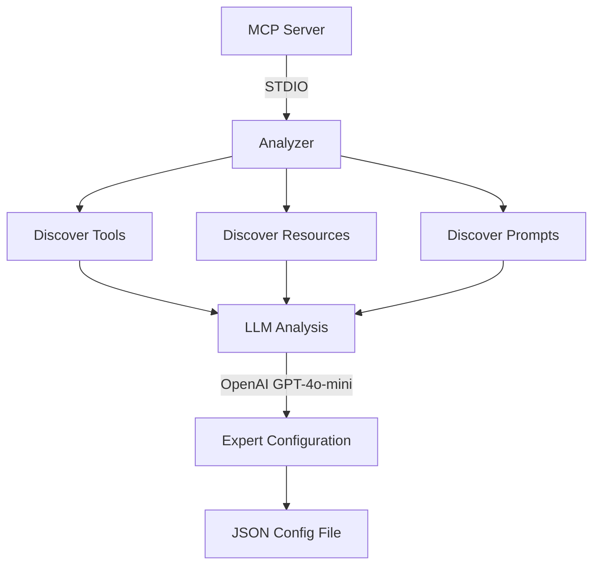
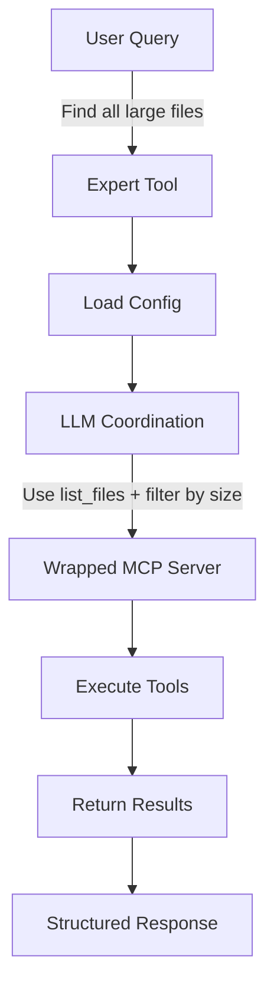

# MCP Context Saver

A powerful tool that analyzes Model Context Protocol (MCP) servers and creates intelligent LLM-powered wrappers around them. Transform any MCP server into an expert system that can understand natural language requests and coordinate complex multi-tool operations automatically.

## Table of Contents

- [Features](#features)
- [Installation](#installation)
  - [NPM Package](#npm-package)
  - [Prerequisites](#prerequisites)
  - [Environment Setup](#environment-setup)
- [Integration with AI Agents](#integration-with-ai-agents)
  - [Claude Desktop](#claude-desktop)
  - [Claude Code](#claude-code-vs-code-extension)
  - [Other MCP-Compatible AI Agents](#other-mcp-compatible-ai-agents)
- [Quick Start](#quick-start)
  - [Analyze an MCP Server](#analyze-an-mcp-server)
  - [Run the Wrapper Server](#run-the-wrapper-server)
- [How It Works](#how-it-works)
- [CLI Reference](#cli-reference)
- [Expert Tool Interface](#expert-tool-interface)
- [Configuration Format](#configuration-format)
- [Development](#development)
- [Examples](#examples)
- [Advanced Usage](#advanced-usage)
- [Troubleshooting MCP Integrations](#troubleshooting-mcp-integrations)
- [Contributing](#contributing)
- [License](#license)
- [Support and Resources](#support-and-resources)

## Features

- **🔍 Automatic Server Analysis**: Discovers tools, resources, and prompts from any MCP server
- **🤖 LLM-Powered Coordination**: Uses OpenAI to intelligently plan and execute multi-tool operations
- **🎯 Expert System Generation**: Transforms servers into domain experts with natural language interfaces
- **🚀 Simple CLI Interface**: Easy-to-use commands for analysis and deployment
- **📊 Rich Configuration System**: Generates comprehensive configs with system prompts and metadata
- **🧪 Production Ready**: Full test coverage, error handling, and TypeScript safety
- **🔌 MCP Protocol Compliant**: Works with any standard MCP server implementation

## Installation

### NPM Package

```bash
# Install globally for CLI usage
npm install -g mcp-context-saver

# Or install locally in your project
npm install mcp-context-saver
```

### Prerequisites

- **Node.js**: Version 18.0.0 or higher
- **npm**: Comes with Node.js
- **OpenAI API Key**: Required for LLM functionality

Verify your environment:
```bash
node --version  # Should be v18.0.0 or higher
npm --version   # Should be 6.0.0 or higher
```

### Environment Setup

**Required Environment Variable:**

```bash
# Set your OpenAI API key (required for both analysis and runtime)
export OPENAI_API_KEY=your-api-key-here
```

> **Note**: The system uses OpenAI GPT-4o-mini for both analysis and runtime coordination. Future versions will support additional LLM providers.

## Integration with AI Agents

### Claude Desktop

To use MCP Context Saver with Claude Desktop, add it to your Claude configuration:

1. **Open Claude Desktop configuration:**

   **macOS/Linux:**
   ```bash
   code ~/Library/Application\ Support/Claude/claude_desktop_config.json
   ```

   **Windows:**
   ```bash
   code %APPDATA%\Claude\claude_desktop_config.json
   ```

2. **Add MCP Context Saver to your configuration:**

   ```json
   {
     "mcpServers": {
       "mcp-context-saver": {
         "command": "npx",
         "args": [
           "-y",
           "mcp-context-saver",
           "serve",
           "/absolute/path/to/your/config.json"
         ],
         "env": {
           "OPENAI_API_KEY": "your-api-key-here"
         }
       }
     }
   }
   ```

   Replace `/absolute/path/to/your/config.json` with the path to your generated configuration file.

3. **Restart Claude Desktop** to load the new configuration.

4. **Verify the connection** by checking the MCP icon in Claude Desktop - it should show your expert server.

### Claude Code (VS Code Extension)

Claude Code automatically discovers MCP servers. To add MCP Context Saver:

1. **Generate a wrapper configuration** for your target MCP server:
   ```bash
   mcp-context-saver analyze /path/to/your/mcp-server
   ```

2. **Create a local configuration file** in your project:
   ```bash
   mkdir .mcp
   echo '{
     "mcpServers": {
       "expert-server": {
         "command": "npx",
         "args": [
           "-y", 
           "mcp-context-saver",
           "serve",
           "./configs/your-server-config.json"
         ],
         "env": {
           "OPENAI_API_KEY": "'$OPENAI_API_KEY'"
         }
       }
     }
   }' > .mcp/config.json
   ```

3. **Claude Code will automatically** detect and load the MCP server when you open the project.

### Other MCP-Compatible AI Agents

MCP Context Saver works with any MCP-compatible client:

#### Amazon Q (Terminal)
```bash
# Install Amazon Q CLI
brew install amazon-q

# Configure with MCP Context Saver
q configure mcp add mcp-context-saver \
  --command "npx -y mcp-context-saver serve /path/to/config.json" \
  --env OPENAI_API_KEY=$OPENAI_API_KEY
```

#### Custom MCP Clients

For custom integrations, use the STDIO transport:

```typescript
import { Client } from "@modelcontextprotocol/sdk/client/index.js";
import { StdioClientTransport } from "@modelcontextprotocol/sdk/client/stdio.js";

const transport = new StdioClientTransport({
  command: "npx",
  args: ["-y", "mcp-context-saver", "serve", "./config.json"],
  env: {
    OPENAI_API_KEY: process.env.OPENAI_API_KEY
  }
});

const client = new Client({
  name: "my-client",
  version: "1.0.0"
}, {
  capabilities: {}
});

await client.connect(transport);
```

## Quick Start

### Analyze an MCP Server

Analyze any MCP server to understand its capabilities:

```bash
mcp-context-saver analyze /path/to/your/mcp-server
```

**What happens during analysis:**
1. **Connection**: Establishes STDIO transport to your MCP server
2. **Discovery**: Interrogates server for all capabilities (tools, resources, prompts)
3. **LLM Analysis**: Uses OpenAI to understand the server's purpose and generate expert identity
4. **Configuration**: Creates a comprehensive JSON config with system prompts and metadata
5. **Validation**: Ensures the configuration is valid and ready for runtime use

### Run the Wrapper Server

Use the generated configuration to run an intelligent wrapper:

```bash
mcp-context-saver serve ./configs/your-server-config.json
```

**The wrapper server transforms your MCP server into an expert system:**
- **Intelligent Coordination**: LLM analyzes requests and automatically selects appropriate tools
- **Natural Language Interface**: Users can make requests in plain English
- **Three Operation Modes**: Discover capabilities, execute tasks, or explain functionality
- **Multi-step Operations**: Handles complex workflows that require multiple tool calls
- **Error Handling**: Graceful failure recovery and informative error messages

## How It Works

### 1. Analysis Phase



The analyzer:
- Connects to your MCP server
- Discovers all available tools, resources, and prompts
- Uses an LLM to understand the server's purpose and capabilities
- Generates a specialized expert configuration with system prompts

### 2. Wrapper Phase



The wrapper:
- Presents a single expert tool to clients
- Uses LLM coordination to understand user requests
- Automatically selects and calls the appropriate underlying tools
- Returns structured results

## CLI Reference

### `analyze` Command

Analyze an MCP server and generate configuration:

```bash
mcp-context-saver analyze <server-path> [args...]
```

**Arguments:**
- `<server-path>`: Path to the MCP server executable
- `[args...]`: Optional arguments to pass to the server

**Examples:**
```bash
# Analyze a JavaScript MCP server
mcp-context-saver analyze ./my-server.js

# Analyze a built Node.js server with arguments
mcp-context-saver analyze /usr/local/bin/mcp-server --config server.json

# Analyze a Python MCP server
mcp-context-saver analyze python my_mcp_server.py

# Analyze with complex arguments
mcp-context-saver analyze node server.js --port 3000 --verbose
```

### `serve` Command

Start the wrapper server with a configuration:

```bash
mcp-context-saver serve <config-path>
```

**Arguments:**
- `<config-path>`: Path to the configuration file generated by `analyze`

**Example:**
```bash
mcp-context-saver serve ./configs/file-manager-1609459200000.json
```

## Expert Tool Interface

The wrapper creates a single expert tool that supports three operation modes:

### Discover Mode

Learn what the expert can do:

```json
{
  "name": "file-manager-expert",
  "arguments": {
    "query": "What can you help me with?",
    "mode": "discover"
  }
}
```

Returns:
- Summary of capabilities
- List of available tools
- Available resources and prompts

### Execute Mode (Default)

Perform tasks using the underlying server:

```json
{
  "name": "file-manager-expert",
  "arguments": {
    "query": "List all files in the /home directory"
  }
}
```

**The LLM coordination process:**
1. **Request Analysis**: Understands the user's intent and requirements
2. **Tool Planning**: Determines which tools are needed and in what sequence
3. **Argument Generation**: Creates appropriate arguments for each tool call
4. **Execution**: Calls the underlying MCP server tools
5. **Result Processing**: Structures and explains the results

### Explain Mode

Get information about the expert:

```json
{
  "name": "file-manager-expert",
  "arguments": {
    "query": "How do you work?",
    "mode": "explain"
  }
}
```

Returns:
- Expert description
- System prompt used for coordination
- Available tools
- Usage instructions

## Configuration Format

Generated configurations are comprehensive and include all necessary metadata:

```json
{
  "name": "File System Expert",
  "description": "Comprehensive file and directory management with search capabilities",
  "serverPath": "/path/to/your/mcp-server",
  "args": ["--config", "server.json"],
  "systemPrompt": "You are a File System Expert with comprehensive capabilities...\n\nWhen users request file operations:\n1. Use list_files to explore directories\n2. Use read_file to examine contents\n3. Always confirm destructive operations",
  "capabilities": {
    "tools": [
      {
        "name": "list_files",
        "description": "List files and directories with filtering options",
        "inputSchema": {
          "type": "object",
          "properties": {
            "path": { "type": "string" },
            "pattern": { "type": "string" }
          }
        }
      }
    ],
    "resources": [
      {
        "uri": "file://current-directory",
        "name": "Current Directory Info"
      }
    ],
    "prompts": [
      {
        "name": "file-operation-template",
        "description": "Template for file operations"
      }
    ]
  },
  "metadata": {
    "analyzedAt": "2023-12-07T10:30:00.000Z",
    "toolCount": 8,
    "resourceCount": 2,
    "promptCount": 1
  }
}
```

## Development

### Prerequisites

- Node.js 18+
- OpenAI API key

### Local Development Setup

```bash
# Clone the repository
git clone https://github.com/your-org/mcp-context-saver.git
cd mcp-context-saver

# Install dependencies
npm install

# Set up environment
export OPENAI_API_KEY=your-api-key-here

# Build the project
npm run build

# Verify installation
npm test
```

### Running Tests

```bash
# Run all tests
npm test

# Run unit tests only
npm run test:unit

# Run integration tests only
npm run test:integration
```

### Development Commands

```bash
# Build TypeScript to JavaScript
npm run build

# Run CLI in development mode (with TypeScript)
npm run dev -- analyze ./simple-test-server.js

# Development with specific commands
npm run analyze -- ./test-server.js
npm run serve -- ./configs/test-config.json

# Clean build artifacts
npm run clean

# Watch mode for continuous building
npm run build -- --watch
```

## Project Structure

```
mcp-context-saver/
├── src/                          # Source TypeScript files
│   ├── analyzer.ts               # Server analysis and config generation
│   ├── wrapper.ts                # Runtime wrapper server
│   ├── cli.ts                    # Command-line interface
│   └── types.ts                  # Type definitions and Zod schemas
├── dist/                         # Compiled JavaScript (gitignored)
├── tests/
│   ├── integration/
│   │   ├── full-flow.test.ts     # End-to-end workflow tests
│   │   ├── mock-server.ts        # TypeScript test server
│   │   └── mock-server.js        # Simple JavaScript test server
│   └── unit/
│       ├── analyzer.test.ts      # Analyzer component tests
│       └── wrapper.test.ts       # Wrapper component tests
├── configs/                      # Generated configurations (gitignored)
├── test-*-server/                # Test MCP servers for development
├── package.json                  # Dependencies and scripts
├── tsconfig.json                 # TypeScript configuration
├── jest.config.js                # Test configuration
├── ARCHITECTURE.md               # System design documentation
├── CONTRIBUTING.md               # Development guidelines
└── README.md                     # This file
```

## Examples

### Example: File Manager Server

```bash
# 1. Analyze a file manager MCP server
mcp-context-saver analyze ./file-manager-server.js

# Output:
# ✓ Analysis complete!
# Expert: File System Expert
# Description: Comprehensive file and directory management with search capabilities
# 
# Capabilities discovered:
#   - 8 tools
#   - 2 resources  
#   - 1 prompts
#
# Configuration saved to: ./configs/file-system-expert-1609459200000.json

# 2. Start the wrapper server
mcp-context-saver serve ./configs/file-system-expert-1609459200000.json

# 3. Use from another MCP client
# The expert tool can now handle requests like:
# "Please find all .js files in the project directory and show me the largest ones"
```

## Advanced Usage

### Intelligent System Prompt Generation

The analyzer uses OpenAI to generate contextual system prompts that help the LLM understand how to coordinate with each specific MCP server:

**Example Generated System Prompt:**
```
You are a File System Expert with comprehensive file and directory management capabilities.

Your available tools allow you to:
- List and search files and directories (list_files)
- Read and write file contents (read_file, write_file)
- Create and delete files and directories (create_dir, delete_file)
- Search for files by patterns and content (search_files)
- Check file permissions and metadata (stat_file)

Coordination Guidelines:
1. For directory exploration, start with list_files
2. For file content tasks, use read_file before making changes
3. For search operations, use search_files with appropriate patterns
4. Always confirm destructive operations with users
5. Provide clear explanations of what you're doing

Error Handling:
- Check if paths exist before operations
- Handle permission errors gracefully
- Provide helpful error messages to users
```

**The system prompt includes:**
- Expert identity and capabilities overview
- Available tool descriptions and usage patterns
- Best practices for tool coordination
- Error handling guidelines
- User interaction principles

### Comprehensive Error Handling

The system provides detailed error messages with actionable guidance:

**Environment Issues:**
```bash
Error: OPENAI_API_KEY environment variable is required

Please set your OpenAI API key:
  export OPENAI_API_KEY=your-api-key

Get an API key at: https://platform.openai.com/api-keys
```

**Server Connection Issues:**
```bash
Error: Failed to connect to MCP server at ./my-server.js

Troubleshooting steps:
  1. Verify the server path is correct
  2. Ensure the server is executable (chmod +x)
  3. Check if dependencies are installed (npm install)
  4. Try running the server directly to test

For Node.js servers, you may need:
  npm run build
```

**Configuration Issues:**
```bash
Error: Failed to load configuration from ./config.json

Possible causes:
  1. File doesn't exist - check the path
  2. Invalid JSON format - validate the file
  3. Missing required fields - regenerate with analyze command

To create a new configuration:
  mcp-context-saver analyze <server-path>
```

**Runtime Coordination Errors:**
```bash
Error: Failed to coordinate with wrapped server

This usually means:
  1. The wrapped server stopped responding
  2. Invalid tool arguments were generated
  3. OpenAI API quota exceeded

Check the wrapper server logs for more details.
```

## Troubleshooting MCP Integrations

### Claude Desktop Issues

**Server not appearing in Claude:**
```bash
# Check Claude's MCP logs
tail -n 20 -f ~/Library/Logs/Claude/mcp*.log  # macOS/Linux
type "%APPDATA%\Claude\logs\mcp*.log"         # Windows

# Common fixes:
# 1. Ensure absolute paths in configuration
# 2. Verify OPENAI_API_KEY is set in env section
# 3. Check that npx is installed globally: npm install -g npx
# 4. Restart Claude Desktop after config changes
```

**Connection failures:**
```bash
# Test the server manually
npx -y mcp-context-saver serve /path/to/config.json

# If this works, the issue is with Claude configuration
# If it fails, check:
# - Config file exists and is valid JSON
# - OPENAI_API_KEY is set correctly
# - The wrapped server path in config is correct
```

### Claude Code Issues

**MCP server not detected:**
```bash
# Ensure .mcp/config.json exists in project root
ls -la .mcp/config.json

# Validate JSON syntax
cat .mcp/config.json | jq .

# Reload VS Code window: Cmd/Ctrl + Shift + P → "Developer: Reload Window"
```

### General MCP Debugging

**Enable debug logging:**
```bash
# Run with debug output
DEBUG=* npx mcp-context-saver serve ./config.json 2>&1 | tee debug.log

# Check for:
# - Connection errors to wrapped server
# - OpenAI API errors
# - Tool execution failures
```

**Verify wrapped server works:**
```bash
# Test the original MCP server directly
echo '{"jsonrpc":"2.0","method":"initialize","id":1,"params":{}}' | node /path/to/original/server.js

# Should return server capabilities
# If not, fix the original server first
```

**Common environment issues:**
```bash
# Windows: APPDATA not found
# Add to configuration:
"env": {
  "OPENAI_API_KEY": "...",
  "APPDATA": "C:\\Users\\YourUsername\\AppData\\Roaming\\"
}

# macOS/Linux: Permission denied
chmod +x /path/to/server.js
```

## Contributing

We welcome contributions! Please see [CONTRIBUTING.md](./CONTRIBUTING.md) for detailed guidelines.

**Quick Start for Contributors:**

1. **Fork and clone** the repository
2. **Set up development environment:**
   ```bash
   npm install
   export OPENAI_API_KEY=your-key
   npm run build
   npm test
   ```
3. **Create a feature branch:** `git checkout -b feature/your-feature`
4. **Make your changes** following the coding standards
5. **Add comprehensive tests** for new functionality
6. **Ensure all tests pass:** `npm test`
7. **Update documentation** as needed
8. **Submit a pull request** with clear description

**Development Resources:**
- [ARCHITECTURE.md](./ARCHITECTURE.md) - System design and component details
- [CONTRIBUTING.md](./CONTRIBUTING.md) - Detailed development guidelines
- `npm run dev -- --help` - Test CLI during development

## License

MIT License - see LICENSE file for details.

## Support and Resources

**Getting Help:**
- 📖 **Documentation**: [ARCHITECTURE.md](./ARCHITECTURE.md) for system design
- 🐛 **Bug Reports**: [GitHub Issues](https://github.com/your-org/mcp-context-saver/issues)
- 💡 **Feature Requests**: [GitHub Issues](https://github.com/your-org/mcp-context-saver/issues)
- 💬 **Discussions**: [GitHub Discussions](https://github.com/your-org/mcp-context-saver/discussions)

**CLI Help:**
```bash
# General help
mcp-context-saver --help

# Command-specific help
mcp-context-saver analyze --help
mcp-context-saver serve --help
```

**Example Projects:**
- Integration tests show real usage patterns
- Test servers demonstrate MCP implementations
- Generated configurations show expected output format

**Related Resources:**
- [Model Context Protocol Specification](https://modelcontextprotocol.io/docs)
- [Official MCP Servers](https://github.com/modelcontextprotocol/servers)
- [OpenAI API Documentation](https://platform.openai.com/docs)